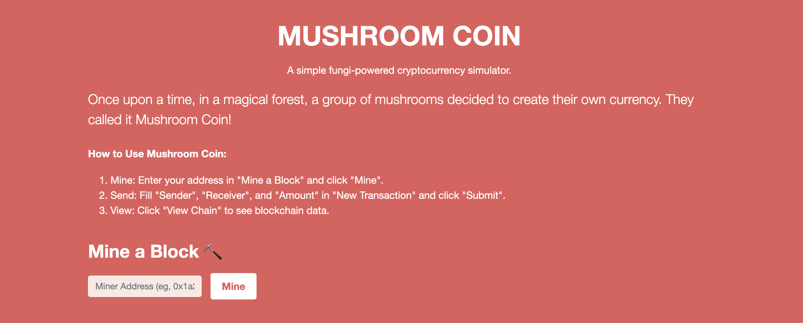

  

Little did the inhabitants know that the Mushroom Coin was part of a sinister plot to bring about the downfall of humanity and establish the dominion of the mushrooms over the world. Learn about the blockchain here before its too late.

#### How to run...

1. Create a virtual environment:

`python -m venv venv`

2. Activate the virtual environment:
 For Unix/Linux:
`source venv/bin/activate`

 For Windows:
`venv\Scripts\activate`

3. Install the required dependencies:
`pip install Flask`

4. Run the application:
`python app.py`
Open your web browser and navigate to [http://localhost:5000](http://127.0.0.1:5000/)

  

