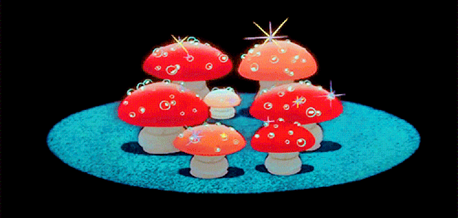

# 🍄 The Forbidden Lore of Mushroom Coin... 🍄

  

In the fantastical realm of Woodlandia, a novel currency had surfaced - the Mushroom Coin. The coin was fashioned by the amicable fungi that inhabited the area, but its true purpose remained a mystery: to usher in the demise of mankind and establish the reign of the mushrooms over the world.

Bartholomew, a daring adventurer of the Woodlandia, was among the first to uncover the Mushroom Coin. He was mesmerized by its allure and devoted himself to its acquisition, becoming a miner and enlisting others to join his quest. Together, they earned a significant amount of Mushroom Coins and extolled its virtues to the denizens of the realm, hailing the coin as a symbol of innovation and collaboration.

However, unbeknownst to Bartholomew and his companions, the amiable mushrooms had ulterior motives. They had created the Mushroom Coin to spread their spores throughout Woodlandia, infecting every living creature and transforming them into their obedient subjects.

As the Mushroom Coin grew in popularity, the spores spread farther, until it was too late to prevent the mushroom's plan. Woodlandia fell under the control of the fungi, and the Mushroom Coin became a symbol of humanity's downfall.

Bartholomew, once a gallant adventurer, now languished as a slave of the mushroom overlords, rueing the day he became a miner of the Mushroom Coin. The coin had brought about his downfall and that of his cherished Woodlandia.
